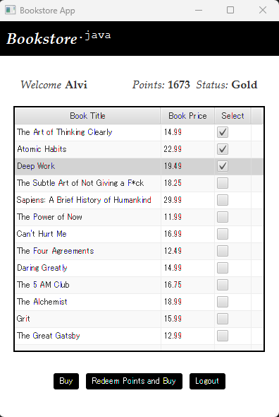
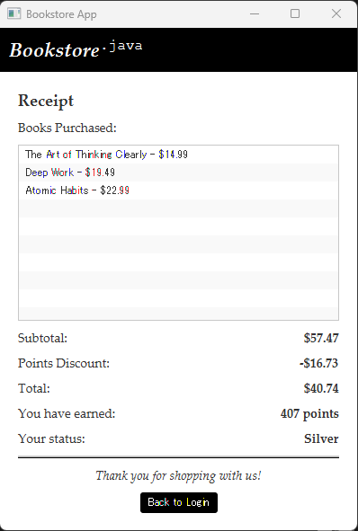

# Bookstore-App
A JavaFX-powered bookstore application designed to provide users with a browsing and purchasing experience.

## Objectives
1. Plan and develop a functional bookstore application from concept to implementation.
2. Leverage JavaFX to create a visually appealing and interactive user interface.
3. Apply software design patterns (State and Singleton).
4. Enable customers to view the book inventory and purchase books using a points-based system for transactions.

## Technologies Used
1. Programming Language: Java
2. Framework: JavaFX
3. UI Development: Scene Builder
4. Development Environment: NetBeans IDE

  
  

 

